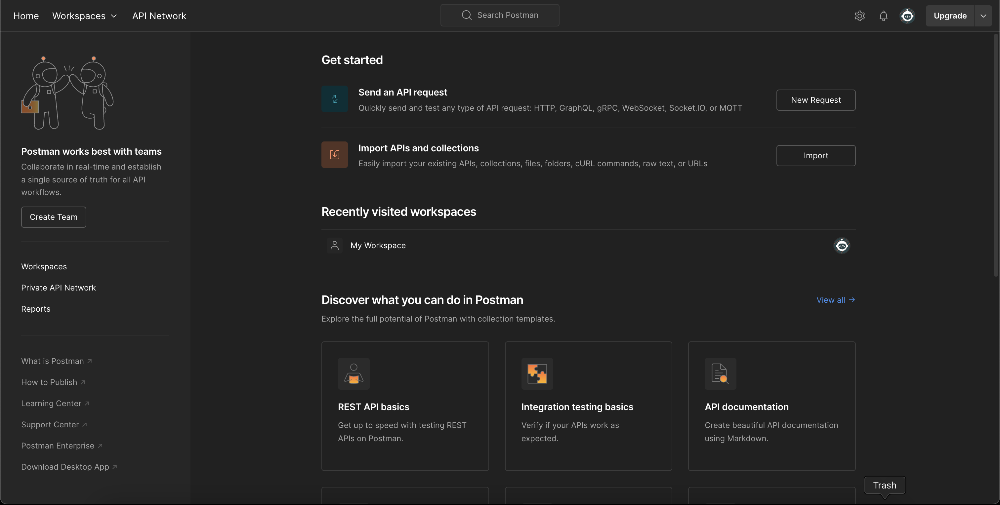
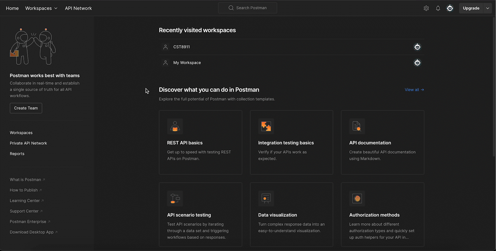
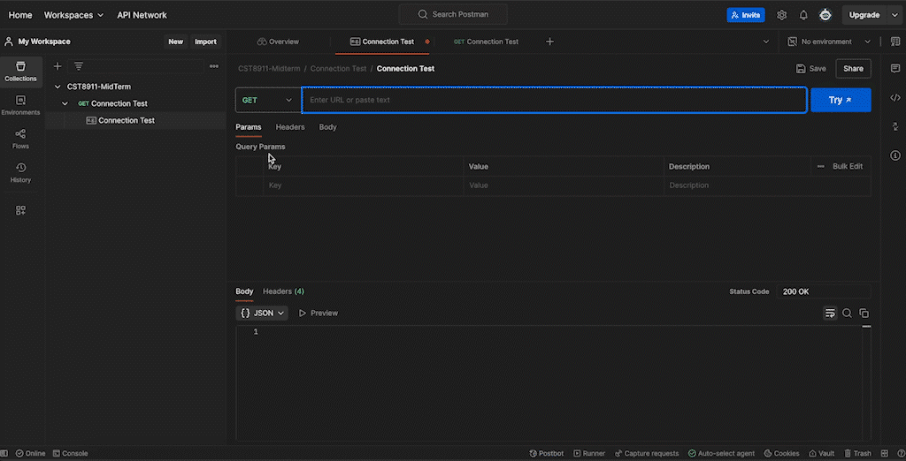

# Postman

In this project, we used Postman as the primary tool for working with the APIs. This tool serves as a bridge to communicate on different APIs, allowing users to perform the CRUD or Create, Update, and Delete. With the Postman interface, it makes working with the API easier as you can organize API requests into collections, automate testing, and work with the team.

Once you successfully register and log in to the account, the homepage will look like this:

## Steps:

### **Create Workspace**
A workspace is a shared environment that enables teams to collaborate on API development, testing, and documentation.

### **Create Collection**
A collection is a set of related API requests designed for easy testing and sharing.

### **Perform Connection Test**
This will verify that the API is accessible and functioning correctly before proceeding with further testing.

### **Configure OAuth2.0 Token**
An OAuth 2.0 token is a digital key that authenticates API requests, proving you have permission to access data or perform actions.

- Select ‘POST’ for request type.
- Click the Authorization tab.
- In the Auth type dropdown, choose OAuth 2.0.

#### Fill-up the Configure New Token Form

| **Field**           | **Value**                                                                                           |
|---------------------|-----------------------------------------------------------------------------------------------------|
| Callback URL        | [https://www.getpostman.com/oauth2/callback](https://www.getpostman.com/oauth2/callback)             |
| Auth URL            | [https://login.microsoftonline.com/8e70bfc6-d0bb-41ef-920b-e02e1d7ac590/oauth2/v2.0/authorize](https://login.microsoftonline.com/8e70bfc6-d0bb-41ef-920b-e02e1d7ac590/oauth2/v2.0/authorize) |
| Access Token URL    | [https://login.microsoftonline.com/8e70bfc6-d0bb-41ef-920b-e02e1d7ac590/oauth2/v2.0/token](https://login.microsoftonline.com/8e70bfc6-d0bb-41ef-920b-e02e1d7ac590/oauth2/v2.0/token) |
| Client ID           | 38a0c582-fa83-4333-95a4-e530349652e2                                                                |
| Client Secret       | d3d3d3d3-d3d3-d3d3-d3d3-d3d3d3d3d3d3                                                           |
| Scope               | api://cst8911-restapi/Group.Read.All                                                                |

#### Use the token
- Click the button 'Get New Access Token'.
- Enter your email.
- Enter the OTP.
- Click the button 'Use Token'.

--- 

Now that we have gained the token, this means **POST** can be made on the object. In this case, we're going to create a course list for  the specific **User**.

